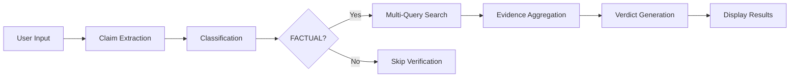

# Live Fact-Checking Chrome Extension

A production-quality Chrome extension that extracts verifiable claims from user-selected text, verifies them using Tavily's web search API, and returns transparent verdicts with citations.


## Features

- **Text Selection or Paste** - Highlight text on any webpage or paste directly into the extension
- **Automatic Claim Extraction** - Splits compound sentences into atomic, verifiable claims
- **Smart Classification** - Categorizes claims as FACTUAL, OPINION, PREDICTION, or AMBIGUOUS
- **Multi-Query Search** - Uses neutral, fact-check, and negated queries to avoid confirmation bias
- **Evidence Aggregation** - Weighs sources by authority, recency, and consensus
- **Transparent Verdicts** - Every verdict includes confidence scores and cited sources
- **Epistemic Humility** - Prefers "Insufficient Evidence" over guessing; confidence capped at 90%

## Architecture

```
extension/
├── src/
│   ├── background/        # Service worker (API calls, orchestration)
│   ├── content/           # Content script (text selection)
│   ├── ui/                # React popup components
│   ├── lib/               # Core logic modules
│   │   ├── types.ts       # TypeScript definitions
│   │   ├── claimExtractor.ts
│   │   ├── tavily.ts
│   │   ├── verifier.ts
│   │   └── verdictEngine.ts
│   └── utils/             # Helpers (messaging, rate limiting)
├── public/
│   ├── manifest.json
│   └── icons/
└── dist/                  # Build output
```

## Claim Classification

| Type | Description | Example |
|------|-------------|---------|
| **FACTUAL** | Objective, verifiable with public sources | "The Eiffel Tower is 330 meters tall" |
| **OPINION** | Subjective, reflects personal views | "The best coffee is from Ethiopia" |
| **PREDICTION** | Future-oriented, cannot verify yet | "AI will replace 50% of jobs by 2030" |
| **AMBIGUOUS** | Lacks context or too vague | "It happened last week" |

## Verdict Labels

| Verdict | Meaning | Color |
|---------|---------|-------|
| **SUPPORTED** | Strong evidence confirms the claim | 🟢 Green |
| **FALSE** | Strong evidence contradicts the claim | 🔴 Red |
| **MISLEADING** | Contains truth but deceptive overall | 🟠 Orange |
| **INSUFFICIENT_EVIDENCE** | Not enough reliable sources | ⚪ Gray |

## Getting Started

### Prerequisites

- Node.js 18+
- A [Tavily API key](https://tavily.com) (free tier available)

### Installation

1. Clone the repository:
   ```bash
   git clone https://github.com/yourusername/Fact-Checker.git
   cd Fact-Checker/extension
   ```

2. Install dependencies:
   ```bash
   npm install
   ```

3. Build the extension:
   ```bash
   npm run build
   ```

4. Load in Chrome:
   - Open `chrome://extensions/`
   - Enable "Developer mode"
   - Click "Load unpacked"
   - Select the `extension/dist` folder

5. Configure API Key:
   - Click the extension icon
   - Enter your Tavily API key in settings
   - Your key is stored locally and never sent to external servers

### Development

Run in watch mode for development:
```bash
npm run dev
```

## Security Model

- **API keys never touch client-side code** - All Tavily API calls go through the background service worker
- **Local storage only** - API keys are stored in `chrome.storage.local`
- **Rate limiting** - 10 requests per minute to protect API quota
- **No external tracking** - No analytics or telemetry

## Design Philosophy

This extension is built with trust and transparency as core values:

1. **Source Transparency** - We ignore Tavily's generated answers and only use raw source content
2. **Epistemic Humility** - Confidence is capped at 90%; we prefer "Insufficient Evidence" over guessing
3. **Conservative Thresholds** - Strong consensus required for definitive verdicts
4. **Authority Weighting** - Government, academic, and fact-check sources weighted higher
5. **Deterministic Outputs** - Heuristic-based classification for reproducible results

## Verification Pipeline



## API Reference

### Claim Extraction

```typescript
import { extractClaims, getFactualClaims } from './lib/claimExtractor';

const claims = extractClaims("The Earth is round and I think it's beautiful.");
// Returns 2 claims: one FACTUAL, one OPINION

const factual = getFactualClaims(claims);
// Returns only FACTUAL claims for verification
```

### Evidence Classification

```typescript
import { processSearchResults, aggregateEvidence } from './lib/verifier';

const evidence = processSearchResults(claim, searchResults);
// Returns AggregatedEvidence with supporting/contradicting/inconclusive arrays
```

### Verdict Generation

```typescript
import { generateVerdict, getVerdictColor } from './lib/verdictEngine';

const verdict = generateVerdict(claim, evidence);
// Returns { verdict, confidence, explanation, citations }
```

## Testing

Test with sample claims:

✅ **True claims:**
- "The Great Wall of China is over 13,000 miles long"
- "Water freezes at 0 degrees Celsius"

❌ **False claims:**
- "The human body has 300 bones"
- "Mount Everest is located in Switzerland"

⚠️ **Opinion claims (won't verify):**
- "Pizza is the best food ever"
- "Summer is the best season"

## License

MIT

## Acknowledgments

- [Tavily](https://tavily.com) for the search API
- Built with React, TypeScript, and Vite
