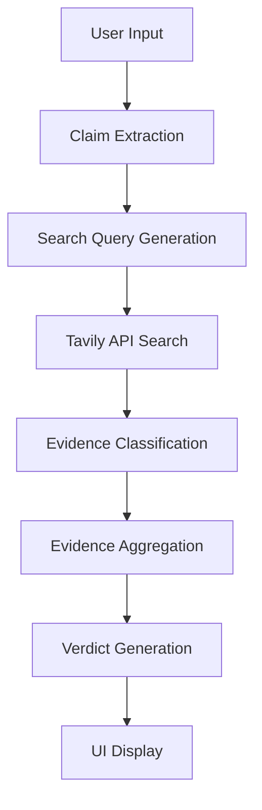

# Fact-Checker Program Flow

This document explains how the Tavily Fact-Checker extension works, step by step, from user input to final verdict.

---

## High-Level Overview



---

## Step-by-Step Breakdown

### 1. User Input (`App.tsx`)

The user enters text into the popup's textarea and clicks **"Verify Claims"**.

```
User types: "Iran fired rockets into Israel in 2025."
         ↓
App.tsx captures inputText state
         ↓
handleVerify() is called
```

**What happens:**
- The `handleVerify` function validates the input
- Sets UI state to `extracting` (shows loading spinner)
- Sends a message to the background service worker

---

### 2. Message Passing (`messaging.ts` → `background/index.ts`)

The popup communicates with the background script via Chrome's messaging API.

```typescript
// From App.tsx
sendToBackground({ type: 'VERIFY_TEXT', text: textToVerify })
```

**What happens:**
- `chrome.runtime.sendMessage()` sends the text to the background
- Background script's `onMessage` listener receives it
- Background calls `verifyText(text)`

---

### 3. Claim Extraction (`claimExtractor.ts`)

The raw text is analyzed to extract individual, verifiable claims.

```
Input: "Iran fired rockets into Israel in 2025. The weather was nice."
         ↓
extractClaims() analyzes each sentence
         ↓
Output: [
  { text: "Iran fired rockets into Israel in 2025", classification: "FACTUAL" },
  { text: "The weather was nice", classification: "OPINION" }
]
```

**Classification Types:**
| Type | Description | Verifiable? |
|------|-------------|-------------|
| `FACTUAL` | Objective, checkable facts | ✅ Yes |
| `OPINION` | Subjective statements | ❌ No |
| `PREDICTION` | Future events | ❌ No |
| `AMBIGUOUS` | Unclear intent | ❌ No |

Only `FACTUAL` claims proceed to verification.

---

### 4. Cache Check (`cache.ts`)

Before making API calls, the system checks if this claim was recently verified.

```
claimHash = hash("iran fired rockets into israel in 2025")
         ↓
Check chrome.storage.local for cached result
         ↓
If found (< 24 hours old): Return cached verdict
If not found: Proceed to API search
```

---

### 5. Search Query Generation (`tavily.ts`)

For each factual claim, search queries are generated.

```typescript
generateSearchQueries(claim)
// Returns: [
//   "Iran fired rockets into Israel 2025",
//   "Iran rocket attack Israel 2025 fact check",
//   "Iran missile strike Israel January 2025"
// ]
```

**Query Strategy:**
- Base query: The claim text itself
- Fact-check query: Adds "fact check" to find dedicated fact-checkers
- Date-specific query: Includes time context when relevant

---

### 6. Tavily API Call (`tavily.ts`)

The Tavily Search API is called to find relevant sources.

```
POST https://api.tavily.com/search
{
  "query": "Iran fired rockets into Israel 2025",
  "search_depth": "advanced",
  "include_raw_content": true,
  "max_results": 5
}
```

**What returns:**
```json
{
  "results": [
    {
      "url": "https://reuters.com/...",
      "content": "Iran launched rockets...",
      "raw_content": "Full article text...",
      "published_date": "2025-01-05"
    }
  ]
}
```

---

### 7. Evidence Classification (`verifier.ts`)

Each search result is analyzed to determine its **stance** toward the claim.

```
For each source:
         ↓
calculateAuthority(url)     → 0.0 to 1.0 score
detectStance(claim, content) → SUPPORTS | CONTRADICTS | INCONCLUSIVE
         ↓
Evidence object created
```

**Stance Detection Logic:**

1. **Numeric Contradiction Check**: If claim says "2025" but source says "2023", that's a contradiction
2. **Semantic Match**: Pattern matching for military actions, founder claims, birth dates, etc.
3. **Keyword Signals**: Looks for words like "confirmed", "verified" (support) or "false", "debunked" (contradict)
4. **Explicit Verdicts**: Detects fact-checker ratings like "PolitiFact: True"

**Authority Scoring:**
| Tier | Examples | Score |
|------|----------|-------|
| 1 | .gov, Reuters, Snopes | 0.95 |
| 2 | NYT, BBC, Guardian | 0.85 |
| 3 | CNN, Forbes, Axios | 0.75 |
| 4 | Wikipedia, Britannica | 0.70 |
| 5 | Unknown .com sites | 0.50 |
| Low | Reddit, Twitter, Breitbart | 0.25 |

---

### 8. Evidence Aggregation (`verifier.ts`)

All classified evidence is combined into a consensus.

```
Evidence: [
  { stance: SUPPORTS, authority: 0.85 },   // BBC
  { stance: SUPPORTS, authority: 0.95 },   // Reuters
  { stance: SUPPORTS, authority: 0.75 },   // CNN
  { stance: INCONCLUSIVE, authority: 0.50 }
]
         ↓
consensusScore = (0.85 + 0.95 + 0.75) / (0.85 + 0.95 + 0.75) = 1.0
         ↓
Strong support → SUPPORTED verdict likely
```

**Consensus Formula:**
```
score = (Σ supporting_authority - Σ contradicting_authority) / Σ total_authority
```
- Score of +1.0 = All sources support
- Score of -1.0 = All sources contradict
- Score near 0 = Mixed or inconclusive

---

### 9. Verdict Generation (`verdictEngine.ts`)

The final verdict is determined based on aggregated evidence.

```
consensusScore >= 0.6 AND supporting >= 2  → SUPPORTED
consensusScore <= -0.6 AND contradicting >= 2 → FALSE
-0.6 < score <= 0.3 AND mixed evidence → MISLEADING
Otherwise → INSUFFICIENT_EVIDENCE
```

**Confidence Calculation:**
- Base: Absolute consensus score
- Boost: +3% per source (max +20%)
- Boost: +5% per high-authority source (max +15%)
- Penalty: 30% reduction for MISLEADING
- Cap: Maximum 90% (epistemic humility)

---

### 10. Cache Storage (`cache.ts`)

The result is cached for future lookups.

```typescript
cacheVerification(claim, verdict, queries)
// Stored in chrome.storage.local with 24-hour expiry
```

---

### 11. UI Display (`ClaimCard.tsx`)

The verdict is rendered in the popup UI.

```
┌─────────────────────────────────────┐
│ "Iran fired rockets into Israel..." │
│ ┌────────────────┐                  │
│ │ ✓ True         │  ← VerdictBadge  │
│ └────────────────┘                  │
│ Confidence: ████████░░ 82%          │
│                                     │
│ Sources:                            │
│ • Reuters: "Iran launched..."       │
│ • BBC: "Rocket attacks..."          │
└─────────────────────────────────────┘
```

---

## File Reference

| File | Purpose |
|------|---------|
| `App.tsx` | Main UI, state management, verification trigger |
| `background/index.ts` | Service worker, orchestrates pipeline |
| `claimExtractor.ts` | Splits text into claims, classifies them |
| `tavily.ts` | API wrapper, query generation |
| `verifier.ts` | Stance detection, evidence classification |
| `verdictEngine.ts` | Final verdict, confidence, explanations |
| `cache.ts` | Local storage caching |
| `messaging.ts` | Chrome message passing utilities |

---

## Error Handling

| Error Type | Handling |
|------------|----------|
| No API key | Redirect to settings page |
| Rate limit (10/min) | Show rate limit error, wait |
| Network failure | Show error, allow retry |
| No claims found | Display "No verifiable claims" |
| Tavily API error | Show specific error message |
